# JSON Visual Editor — Complete User Flows, Actions & Scenarios Mapping

> Phase 0 artifact. Mapped from live site (https://jsonvisualeditor.com/) on both desktop and mobile viewports, plus `src/components` code inspection.

---

## Table of Contents

1. [Application Layout Overview](#1-application-layout-overview)
2. [All Buttons & Controls](#2-all-buttons--controls)
3. [Flow 1 — Add Field via Drag-and-Drop (Desktop)](#3-flow-1--add-field-via-drag-and-drop-desktop)
4. [Flow 2 — Add Field via Form (Mobile)](#4-flow-2--add-field-via-form-mobile)
5. [Flow 3 — Inline Value Editing](#5-flow-3--inline-value-editing)
6. [Flow 4 — Rename Object Key](#6-flow-4--rename-object-key)
7. [Flow 5 — Drag-and-Drop Node Reordering](#7-flow-5--drag-and-drop-node-reordering)
8. [Flow 6 — Manual JSON Editing (Code Panel)](#8-flow-6--manual-json-editing-code-panel)
9. [Flow 7 — Copy / Download JSON](#9-flow-7--copy--download-json)
10. [Flow 8 — Theme Toggle](#10-flow-8--theme-toggle)
11. [Flow 9 — Expand / Collapse Tree](#11-flow-9--expand--collapse-tree)
12. [Flow 10 — Change Node Type](#12-flow-10--change-node-type)
13. [Flow 11 — Delete Node](#13-flow-11--delete-node)
14. [Cross-Cutting: Locking During JSON Edit](#14-cross-cutting-locking-during-json-edit)
15. [Component Hierarchy (Atomic Design)](#15-component-hierarchy-atomic-design)
16. [Store Responsibilities](#16-store-responsibilities)
17. [Service Layer](#17-service-layer)
18. [Documentation](#18-documentation)

---

## 1. Application Layout Overview

### Desktop (>= `md` breakpoint, 900px+)

```
┌──────────────────────────────────────────────────────────┐
│ TopBar: [Logo "JSON Visual Editor"] [Theme] [GitHub]    │
├────────────────────────┬─────────────────────────────────┤
│ Modelo (visual)        │ JSON Final                      │
│ Edicao total + form.   │ Somente leitura                 │
│                        │                                 │
│ [string][number]...    │ [Editar][Copiar][Cop. minif]   │
│ [boolean][object]      │ [Baixar]                        │
│ [array][null]          │                                 │
│                        │ ┌─────────────────────────────┐ │
│ (tree of nodes)        │ │ CodeMirror (read-only)      │ │
│                        │ │ { }                         │ │
│                        │ └─────────────────────────────┘ │
│ [Arraste itens para ca]│                                 │
└────────────────────────┴─────────────────────────────────┘
```

Two-column grid: `VisualEditor` (left 50%) + `JsonPanel` (right 50%).

### Mobile (< `md` breakpoint, < 900px)

```
┌──────────────────────────┐
│ TopBar: [Logo] [Theme]   │
│            [GitHub]      │
├──────────────────────────┤
│ Modelo (visual)          │
│ Edicao total + form.     │
│                          │
│ ┌──────────────────────┐ │
│ │ AddFieldForm:        │ │
│ │  Inserir em [____▼]  │ │
│ │  Tipo [______▼]      │ │
│ │  Nome [________]     │ │
│ │  Valor [_______]     │ │
│ │  Nulo [toggle]       │ │
│ │  [Adicionar]         │ │
│ └──────────────────────┘ │
│                          │
│ (tree of nodes)          │
│ [Arraste itens para ca]  │
├──────────────────────────┤
│ JSON Final               │
│ Somente leitura          │
│ [Edit][Copy][Minif][DL]  │  ← icon buttons (26x26)
│ ┌──────────────────────┐ │
│ │ CodeMirror            │ │
│ └──────────────────────┘ │
└──────────────────────────┘
```

Stacked vertical layout: `AddFieldForm` replaces the type palette; JsonPanel buttons become icon-only with tooltips.

---

## 2. All Buttons & Controls

### TopBar (always visible)

| # | Button | Icon | Action | Source |
|---|--------|------|--------|--------|
| T1 | Theme toggle | Sun / Moon | Flips light/dark mode, persists to localStorage | `TopBar/index.tsx` |
| T2 | GitHub link | GitHub logo | Opens `https://github.com/GleisonOliveira/json-visual-editor` in new tab | `TopBar/index.tsx` |

### Visual Editor — Type Palette (desktop only)

| # | Button | Draggable | Drag Payload | Source |
|---|--------|-----------|-------------|--------|
| P1 | `string` | Yes (disabled when editingJson) | `{ fromPalette: true, paletteType: 'string' }` | `VisualEditor/index.tsx` |
| P2 | `number` | Yes | `{ fromPalette: true, paletteType: 'number' }` | `VisualEditor/index.tsx` |
| P3 | `boolean` | Yes | `{ fromPalette: true, paletteType: 'boolean' }` | `VisualEditor/index.tsx` |
| P4 | `object` | Yes | `{ fromPalette: true, paletteType: 'object' }` | `VisualEditor/index.tsx` |
| P5 | `array` | Yes | `{ fromPalette: true, paletteType: 'array' }` | `VisualEditor/index.tsx` |
| P6 | `null` | Yes | `{ fromPalette: true, paletteType: 'null' }` | `VisualEditor/index.tsx` |

### Visual Editor — Tree Node Controls

| # | Control | Per | Action | Source |
|---|---------|-----|--------|--------|
| N1 | Drag handle (GripVertical) | Each ObjectItem/ArrayItem | Initiates HTML5 drag with `{ fromPath, fromKey }` | `NodeEditor/index.tsx` |
| N2 | Delete (Trash2) | Each ObjectItem/ArrayItem | Removes node from parent | `NodeEditor/index.tsx` |
| N3 | Key name TextField | Each ObjectItem | Renames key on blur | `NodeEditor/index.tsx` |
| N4 | Expand/Collapse chevron | Complex nodes (object/array) | Toggles expanded state | `NodeEditor/index.tsx` |
| N5 | Type selector (Select) | Each node (including root) | Changes node type, sets default value | `NodeEditor/index.tsx` |
| N6 | Value editor (TextField/NumberField/Select) | Primitive nodes | Updates value on change | `NodeEditor/index.tsx` |

### Visual Editor — Root-Level Controls

| # | Button | Condition | Action | Source |
|---|--------|-----------|--------|--------|
| R1 | "Expandir todos" | When complex children exist | Expands all nested nodes | `NodeEditor/index.tsx` |
| R2 | "Recolher todos" | When complex children exist | Collapses entire tree | `NodeEditor/index.tsx` |
| R3 | ContainerDropZone | At bottom of each expanded node + root | Drop target for palette or node moves | `ContainerDropZone/index.tsx` |

### AddFieldForm (mobile only)

| # | Control | Type | Action | Source |
|---|---------|------|--------|--------|
| A1 | "Inserir em" (Target) | Select dropdown | Lists all objects/arrays in tree | `AddFieldForm/index.tsx` |
| A2 | "Tipo" (Type) | Select dropdown | string/number/boolean/object/array | `AddFieldForm/index.tsx` |
| A3 | "Nome do campo" | TextField | Key name (disabled for arrays) | `AddFieldForm/index.tsx` |
| A4 | "Valor" (Value) | TextField/Select | Value input (varies by type) | `AddFieldForm/index.tsx` |
| A5 | "Nulo" (Null) | Switch | Marks value as null, disables type/value | `AddFieldForm/index.tsx` |
| A6 | "Adicionar" (Add) | Button | Validates with Zod, inserts field | `AddFieldForm/index.tsx` |

### JsonPanel — Read-Only Mode

| # | Button | Desktop | Mobile | Action | Source |
|---|--------|---------|--------|--------|--------|
| J1 | Editar JSON | Full Button | Icon Button (Pencil) | Enters JSON editing mode | `JsonPanel/index.tsx` |
| J2 | Copiar | Full Button | Icon Button (Copy) | Copies pretty-printed JSON to clipboard | `JsonPanel/index.tsx` |
| J3 | Copiar minificado | Full Button | Icon Button (Copy) | Copies minified JSON to clipboard | `JsonPanel/index.tsx` |
| J4 | Baixar | Full Button | Icon Button (Download) | Downloads data.json file | `JsonPanel/index.tsx` |

### JsonPanel — Editing Mode

| # | Button | Desktop | Mobile | Action | Source |
|---|--------|---------|--------|--------|--------|
| J5 | Validar | Full Button (CheckCheck) | Icon Button | Parses JSON, replaces tree, exits edit | `JsonPanel/index.tsx` |
| J6 | Cancelar | Full Button (X) | Icon Button | Discards changes, exits edit mode | `JsonPanel/index.tsx` |

---

## 3. Flow 1 — Add Field via Drag-and-Drop (Desktop)

> Only available on desktop. The type palette is hidden on mobile (replaced by AddFieldForm).

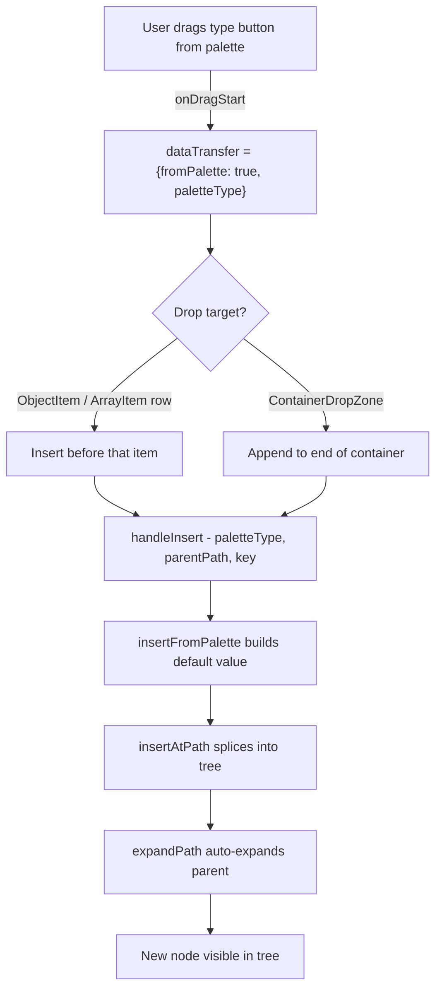

**Components involved:** `VisualEditor` (organism), `PalettePanel` (molecule), `PaletteButton` (atom), `ObjectItem` (molecule), `ArrayItem` (molecule), `ContainerDropZone` (atom)

**Store actions:** `jsonStore.handleInsert`, `uiStore.expandPath`

---

## 4. Flow 2 — Add Field via Form (Mobile)

> Only available on mobile. The AddFieldForm is hidden on desktop.

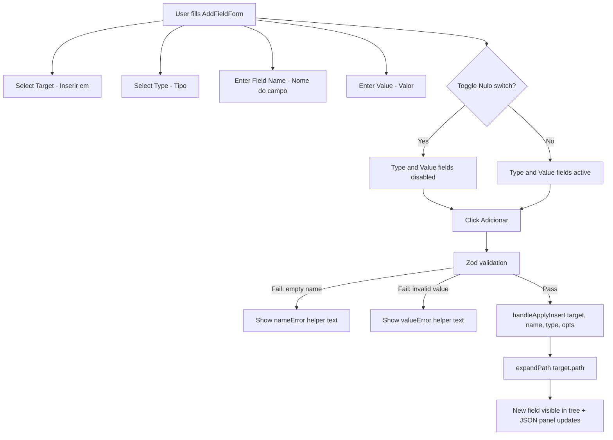

**Components involved:** `AddFieldForm` (molecule), `NodeEditor` (organism)

**Store actions:** `jsonStore.handleApplyInsert`, `uiStore.expandPath`, `uiStore.setFieldName`, `uiStore.setFieldType`, `uiStore.setTargetLabel`, `uiStore.setValueText`, `uiStore.setValueNumberText`, `uiStore.setValueBoolean`, `uiStore.setValueIsNull`, `uiStore.setNameError`, `uiStore.setValueError`

---

## 5. Flow 3 — Inline Value Editing

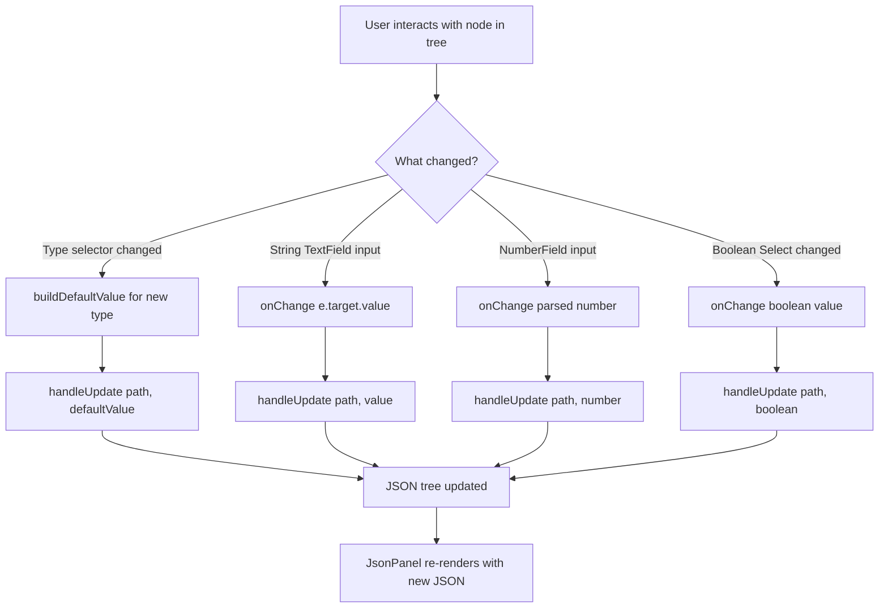

**Components involved:** `NodeEditor` (organism), `InlineNodeEditor` (molecule), `TypeSelector` (atom), `ValueInput` (atom), `NumberField` (atom)

**Store actions:** `jsonStore.handleUpdate`

---

## 6. Flow 4 — Rename Object Key

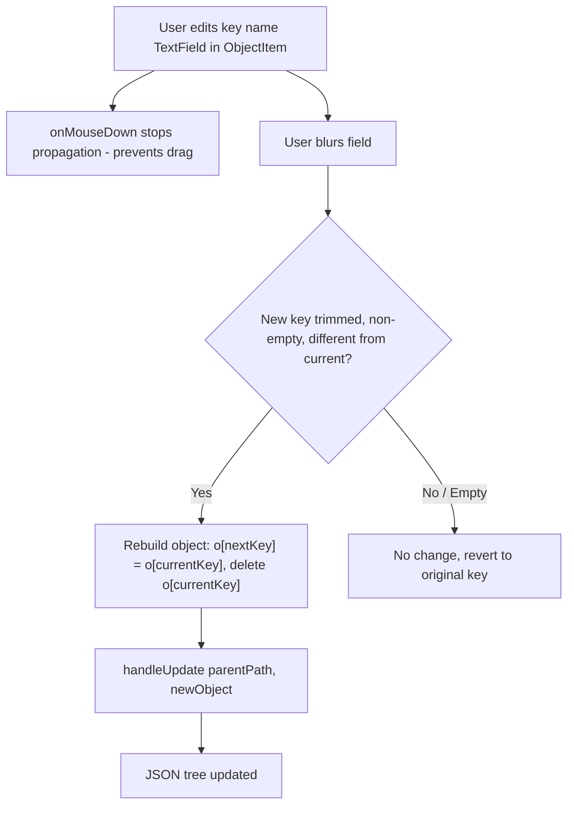

**Components involved:** `ObjectItem` (molecule)

**Store actions:** `jsonStore.handleUpdate`

---

## 7. Flow 5 — Drag-and-Drop Node Reordering

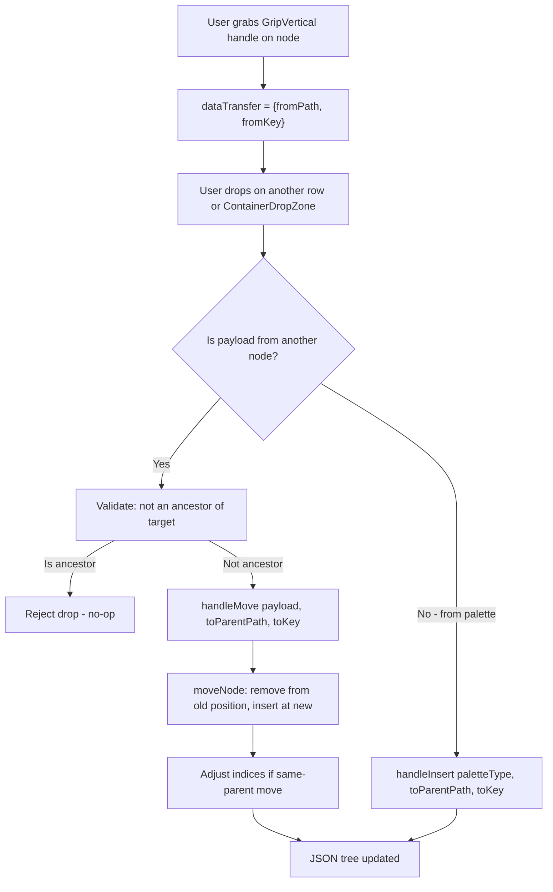

**Components involved:** `ObjectItem` (molecule), `ArrayItem` (molecule), `ContainerDropZone` (atom)

**Store actions:** `jsonStore.handleMove`, `jsonStore.handleInsert`

**Safety:** Circular reference prevention — cannot drop a node onto its own descendants.

---

## 8. Flow 6 — Manual JSON Editing (Code Panel)

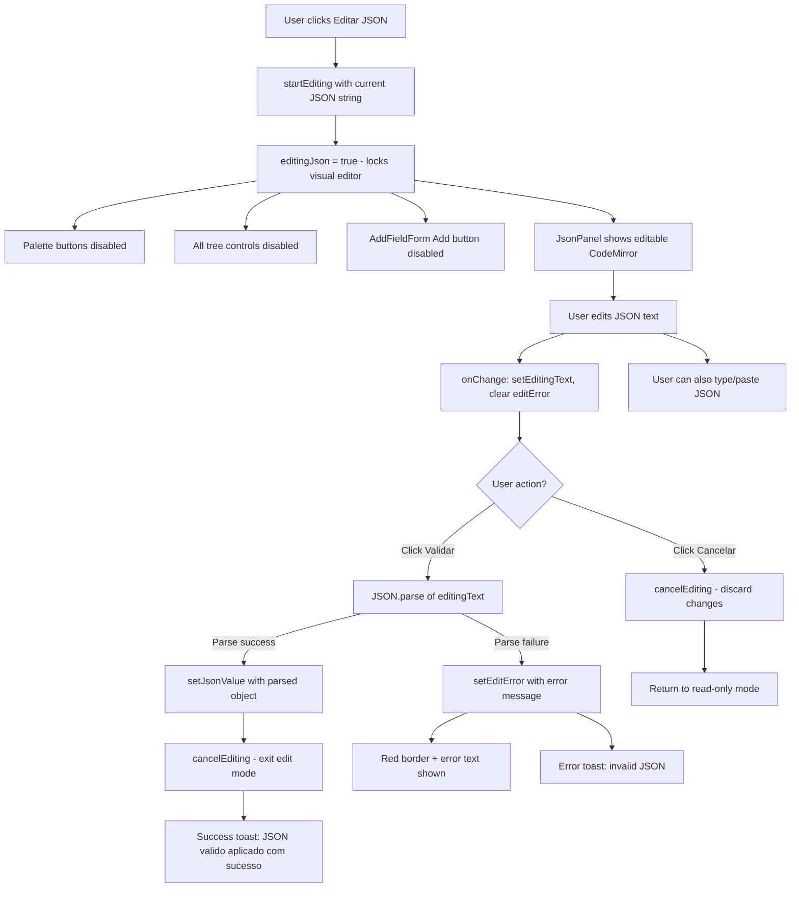

**Components involved:** `JsonPanel` (organism), `JsonToolbar` (molecule), `VisualEditor` (organism, locked state), `NodeEditor` (organism, locked state)

**Store actions:** `uiStore.startEditing`, `uiStore.cancelEditing`, `uiStore.setEditingText`, `uiStore.setEditError`, `jsonStore.setJsonValue`, `uiStore.setToast`

---

## 9. Flow 7 — Copy / Download JSON

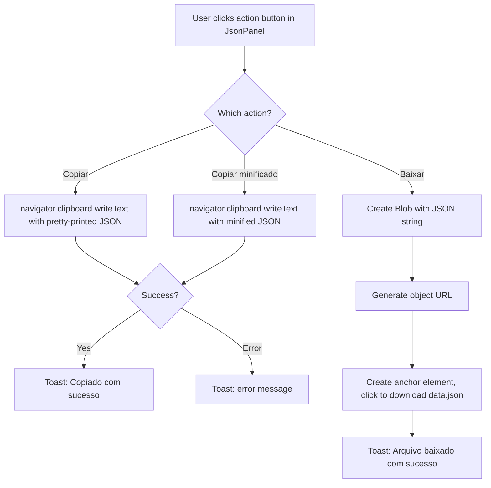

**Components involved:** `JsonPanel` (organism), `JsonToolbar` (molecule)

**Store actions:** `uiStore.setToast`

---

## 10. Flow 8 — Theme Toggle

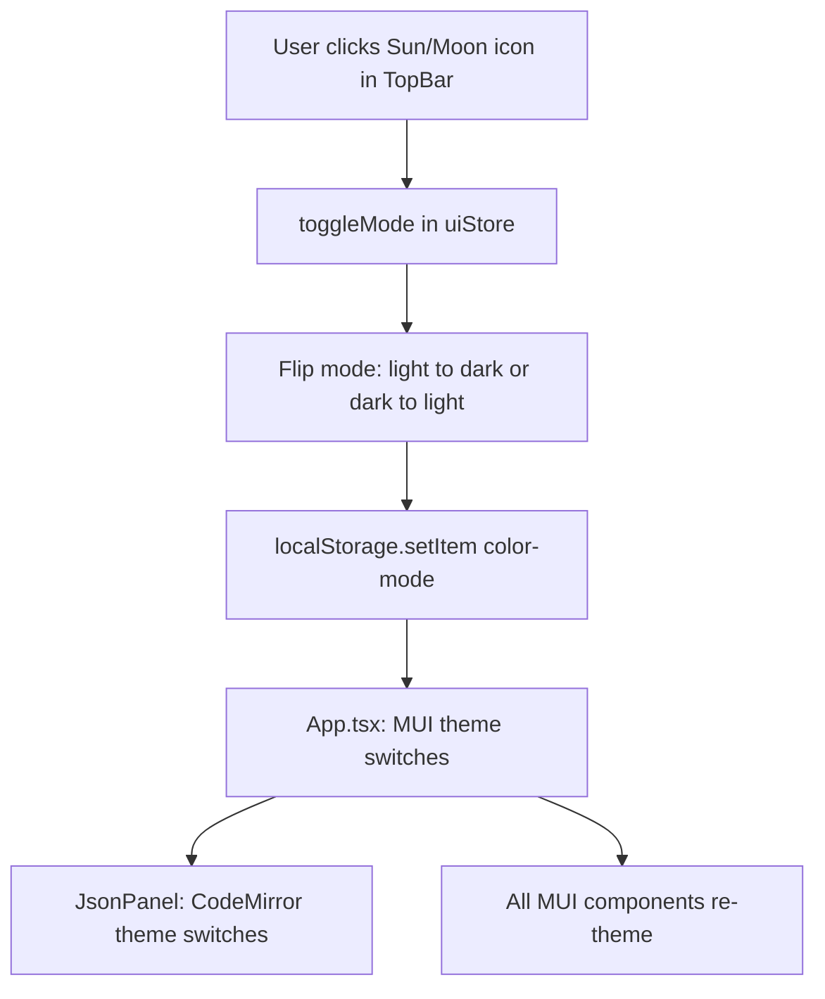

**Components involved:** `TopBar` (organism), `App`

**Store actions:** `uiStore.toggleMode`

---

## 11. Flow 9 — Expand / Collapse Tree

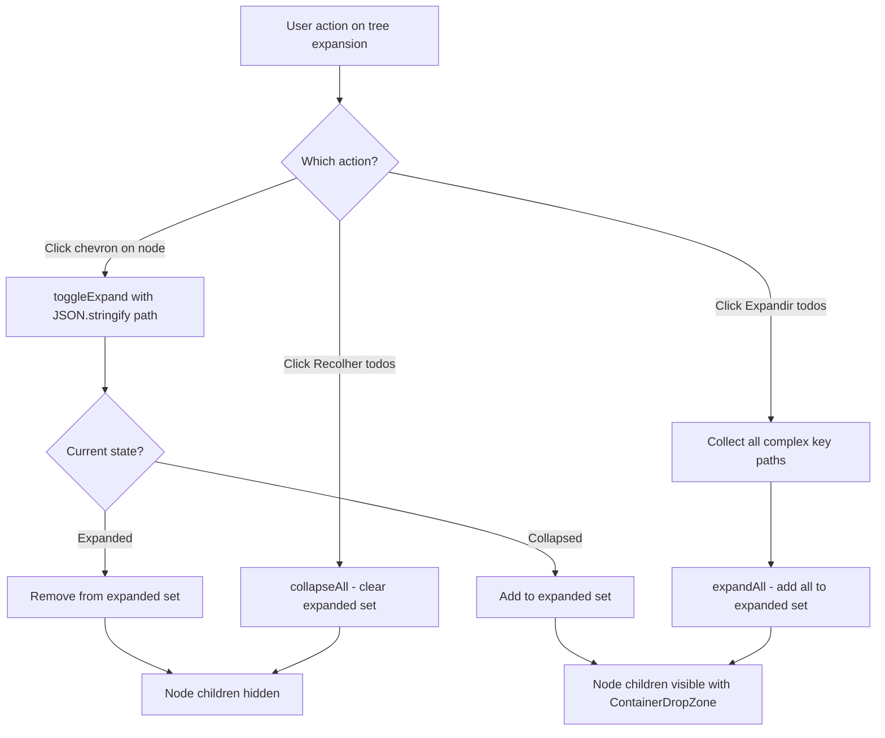

**Components involved:** `NodeEditor` (organism), `ObjectItem` (molecule), `ArrayItem` (molecule)

**Store actions:** `uiStore.toggleExpand`, `uiStore.expandAll`, `uiStore.collapseAll`

---

## 12. Flow 10 — Change Node Type

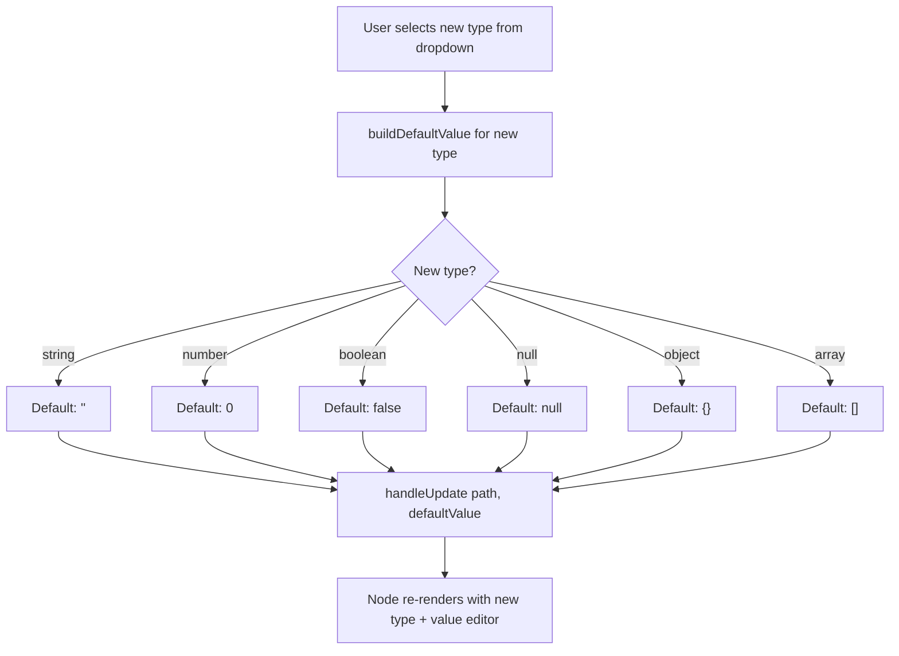

**Components involved:** `NodeEditor` (organism, root), `InlineNodeEditor` (molecule), `TypeSelector` (atom)

**Store actions:** `jsonStore.handleUpdate`

---

## 13. Flow 11 — Delete Node

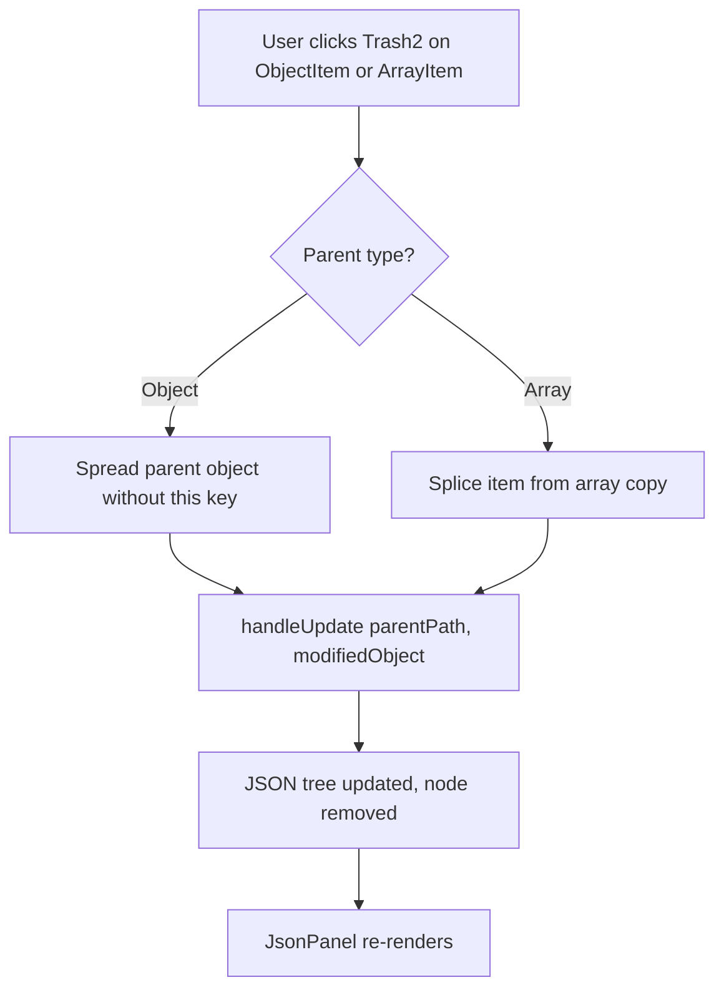

**Components involved:** `ObjectItem` (molecule), `ArrayItem` (molecule)

**Store actions:** `jsonStore.handleUpdate`

---

## 14. Cross-Cutting: Locking During JSON Edit

When `editingJson === true` in `uiStore`:

| Component | Locked Behavior |
|-----------|----------------|
| Type palette buttons | `draggable={false}` + `disabled` |
| AddFieldForm "Adicionar" | `disabled` |
| All NodeEditor type selectors | `disabled` |
| All drag handles | `draggable={false}` |
| All delete buttons | `disabled` |
| Key rename fields | `disabled` |
| Visual editor styling | `opacity: 0.5`, `pointerEvents: 'none'` |

---

## 15. Component Hierarchy (Atomic Design)

Components follow atomic design: atoms (smallest UI units), molecules (composed atoms with logic), organisms (complex UI sections). Each component uses the template+composable pattern (`ComponentName.tsx` + `useComponentName.ts`). All services are resolved via Inversify DI container (`useContainer()`).

```
App
├── TopBar                              [uiStore]                             organism
├── Grid (2 columns / stacked)
│   ├── VisualEditor                    [uiStore]                             organism
│   │   ├── PalettePanel                [uiStore]           ← desktop only   molecule
│   │   │   └── PaletteButton (×6)      [uiStore]                            atom
│   │   ├── AddFieldForm                [uiStore, jsonStore] ← mobile only  molecule
│   │   └── NodeEditor                  [jsonStore, uiStore]                 organism
│   │       ├── TypeSelector (root)     [jsonStore]                          atom
│   │       ├── ObjectItem (recursive)  [jsonStore, uiStore]                 molecule
│   │       │   ├── InlineNodeEditor    [jsonStore]                          molecule
│   │       │   │   ├── TypeSelector    [jsonStore]                          atom
│   │       │   │   └── ValueInput      [jsonStore]                          atom
│   │       │   ├── ObjectItem (nested) [recursive]
│   │       │   ├── ArrayItem (nested)  [recursive]
│   │       │   └── ContainerDropZone   [jsonStore, uiStore]                 atom
│   │       ├── ArrayItem (recursive)   [jsonStore, uiStore]                 molecule
│   │       │   ├── InlineNodeEditor    [jsonStore]                          molecule
│   │       │   ├── ObjectItem (nested) [recursive]
│   │       │   ├── ArrayItem (nested)  [recursive]
│   │       │   └── ContainerDropZone   [jsonStore, uiStore]                 atom
│   │       └── ContainerDropZone       [jsonStore, uiStore] ← root level   atom
│   └── JsonPanel                       [uiStore, jsonStore]                 organism
│       ├── JsonToolbar                 [uiStore, jsonStore]                 molecule
│       └── CodeMirror editor
└── Snackbar + Alert (toast)            [uiStore]
```

---

## 16. Store Responsibilities

### `jsonStore` — JSON document state

Actions are created via a factory pattern: `createJsonActions(container)` receives the Inversify container and resolves `JsonMutationService` internally. See [docs/store.md](../docs/store.md) for details.

| Action | Purpose |
|--------|---------|
| `setJsonValue` | Replace entire JSON tree (used by JSON edit validation) |
| `handleUpdate` | Update a single node at a path |
| `handleMove` | Move a node from one position to another (drag-and-drop) |
| `handleInsert` | Insert a new node from the type palette (drag-and-drop) |
| `handleApplyInsert` | Insert a new field from the AddFieldForm (mobile) |

**State:** `jsonValue: JsonValue`

### `uiStore` — UI-only state

| Category | Properties |
|----------|------------|
| Theme | `mode`, `toggleMode()` — light/dark, persisted to localStorage |
| Tree expansion | `expanded`, `toggleExpand`, `expandPath`, `collapseAll`, `expandAll` |
| JSON editing mode | `editingJson`, `editingText`, `editError`, `startEditing`, `cancelEditing` |
| Toast | `toast`, `setToast` |
| AddFieldForm fields | `fieldName`, `fieldType`, `targetLabel`, `valueText`, `valueNumberText`, `valueBoolean`, `valueIsNull`, `nameError`, `valueError` + setters |

---

## 17. Service Layer

All pure business logic is extracted into service classes with constructor DI. Services are registered in the Inversify container as singletons. See [docs/services.md](../docs/services.md) for details.

| Service | Responsibility |
|---------|---------------|
| `JsonTreeService` | Pure tree traversal: get, set, remove, insert at path, type guards |
| `JsonMutationService` | Tree mutations: move, insert from palette, apply form insert |
| `JsonValidationService` | Form validation and JSON string parsing |
| `ClipboardService` | Wrapper around `navigator.clipboard.writeText()` |
| `FileDownloadService` | Browser file download via Blob + anchor click |

---

## 18. Documentation

| File | Contents |
|------|----------|
| `AGENTS.md` | Project overview, stack, folder structure, DI/component/service/store/testing conventions |
| `docs/architecture.md` | DI container, service wiring, data flow, responsive layout |
| `docs/components.md` | Atomic design, template+composable pattern, component tree, adding new components |
| `docs/testing.md` | Vitest setup, test conventions, ContainerProvider pattern, writing behavioral tests |
| `docs/services.md` | Service classes, DI tokens, constructor injection, adding new services |
| `docs/store.md` | Store conventions, action splitting, domain separation, adding new stores |
| `doc/user-flows-mapping.md` | This file — complete user flows, actions, and scenarios mapping |

---

*Generated from live site browsing (desktop 1280x720 + mobile 375x812) and source code analysis.*
